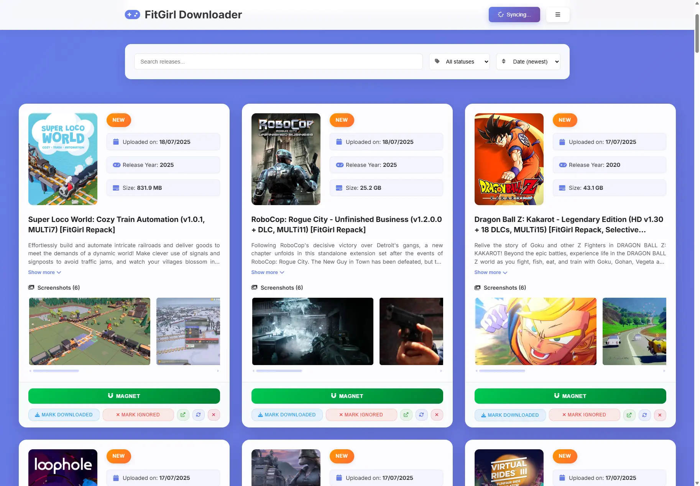

# FitGirl Downloader

A self hosted web application to track and manage FitGirl game releases with automatic scrapping from 1337x.



## Why?

This application provides a **safe and organized way** to track FitGirl releases without exposing yourself to potentially malicious websites. Instead of manually visiting torrent sites, you can:

- **Better tracking**: Organize releases with custom statuses (New, Downloaded, Ignored)
- **Enhanced search**: Find specific games quickly as you type
- **Safe browsing**: Avoid direct exposure to potentially malicious torrent sites
- **Centralized management**: Keep all release information in one secure location
- **Screenshot gallery**: View game screenshots in HD without visiting external sites
- **Magnet link access**: Get direct download links safely

## 🚀 Features

- **Real-time synchronization** with 1337x for new FitGirl releases
- **Web interface** for browsing and managing releases
- **Status tracking** (New, Downloaded, Ignored)
- **Search functionality** across all releases
- **Screenshot gallery** with high-quality image viewing
- **Magnet link support** for direct downloads
- **Docker support** for easy deployment
- **Statistics dashboard** with release counts and sync status
- **Enhanced UI/UX** with modern responsive design
- **WebSocket real-time updates** for live synchronization progress
- **Improved error handling** and logging

## ⚠️ Limitations

### 1. Initial Scraping Limit
Due to how 1337x works, only the **first 2000 releases** can be scraped during the initial synchronization. After that, new releases will be added as they are discovered during subsequent syncs. To get more historical releases, you would need to clear the database and start fresh.

### 2. Publication Date Accuracy
1337x displays dates dynamically (e.g., "1 day ago", "1 month ago"), so publication dates for older releases might be slightly inaccurate. This doesn't affect the app's functionality but may show dates that don't exactly match the original FitGirl release dates.

## 📋 Requirements

- Python 3.10+
- Chrome/Chromium browser (for Selenium)
- Docker (optional, for containerized deployment)

## 🛠️ Installation

### Local Development

1. **Clone the repository**
   ```bash
   git clone https://github.com/ravioldev/fitgirl-downloader
   cd firgirl-updater
   ```

2. **Create virtual environment**
   ```bash
   python -m venv venv
   source venv/bin/activate  # On Windows: venv\Scripts\activate
   ```

3. **Install dependencies**
   ```bash
   pip install -r requirements.txt
   ```

4. **Configure the application**
   ```bash
   # Edit config.yaml with your preferences
   nano config.yaml
   ```

5. **Run the application**
   ```bash
   python app.py
   ```

6. **Access the web interface**
   Open http://localhost:2121 in your browser

### Docker Deployment

1. **Build and run with Docker Compose**
   ```bash
   docker-compose up -d
   ```

2. **Access the application**
   Open http://localhost:2121 in your browser

3. **View logs**
   ```bash
   docker-compose logs -f fitgirl-updater
   ```

4. **Stop the application**
   ```bash
   docker-compose down
   ```

## 📁 Project Structure

```
firgirl-updater/
├── backend/                 # Backend modules
│   ├── game_release.py     # Release data model
│   ├── json_database_manager.py  # Database management
│   ├── settings_manager.py # Configuration management
│   └── x1337_scraper.py   # Web scraping logic
├── static/                 # Frontend assets
│   ├── css/               # Stylesheets
│   ├── js/                # JavaScript files
│   └── images/            # Images and icons
├── templates/              # HTML templates
├── docker/                 # Docker configuration
├── docs/                   # Documentation
├── logs/                   # Application logs
├── app.py                  # Main Flask application
├── config.yaml             # Configuration file
├── requirements.txt        # Python dependencies
└── docker-compose.yml     # Docker orchestration
```

## ⚙️ Configuration

Edit `config.yaml` to customize the application:

```yaml
# Web server settings
web_host: "0.0.0.0"  # Use "127.0.0.1" for external access
web_port: 2121
debug_mode: false

# Scraping settings
max_concurrent_requests: 5
timeout: 30

# Database settings
database_file: "fitgirl_releases.json"
```

## 🔧 Usage

### Web Interface

1. **Browse Releases**: View all FitGirl releases with filtering options
2. **Search**: Use the search bar to find specific games
3. **Status Management**: Mark releases as Downloaded or Ignored
4. **Synchronization**: Click "Sync" to fetch new releases from 1337x
5. **Statistics**: View release statistics and sync status

### API Endpoints

- `GET /api/releases` - Get releases with filtering and pagination
- `POST /api/sync` - Start synchronization
- `GET /api/statistics` - Get release statistics
- `PUT /api/releases/{id}/status` - Update release status
- `DELETE /api/releases/{id}` - Delete a release

## 🐳 Docker Management

### Using Management Scripts

**Windows PowerShell:**
```powershell
.\docker-scripts.ps1 build
.\docker-scripts.ps1 start
.\docker-scripts.ps1 stop
.\docker-scripts.ps1 logs
.\docker-scripts.ps1 status
```

**Linux/Mac:**
```bash
./docker-scripts.sh build
./docker-scripts.sh start
./docker-scripts.sh stop
./docker-scripts.sh logs
./docker-scripts.sh status
```

### Manual Docker Commands

```bash
# Build image
docker-compose build

# Start services
docker-compose up -d

# View logs
docker-compose logs -f

# Stop services
docker-compose down

# Rebuild and restart
docker-compose up -d --build
```

## 📊 Features

### Release Management
- **Automatic synchronization** with 1337x
- **Status tracking** (New, Downloaded, Ignored)
- **Search and filtering** capabilities
- **Screenshot gallery** with navigation
- **Magnet link support**

### Web Interface
- **Responsive design** for mobile and desktop
- **Real-time updates** via WebSocket
- **Statistics dashboard**
- **Progress tracking** for synchronization
- **Toast notifications**

### Data Persistence
- **JSON database** for releases
- **Configuration file** for settings
- **Log files** for debugging
- **Docker volumes** for data persistence

## 🔍 Troubleshooting

### Common Issues

1. **Selenium/Chrome issues**
   - Ensure Chrome is installed
   - Check ChromeDriver compatibility
   - Verify Docker container has Chrome support

2. **Database issues**
   - Check file permissions for `fitgirl_releases.json`
   - Verify JSON file integrity
   - Backup database before major changes

3. **Network issues**
   - Check firewall settings
   - Verify 1337x accessibility
   - Review request delays in configuration

### Logs

- **Application logs**: Check `logs/` directory
- **Docker logs**: `docker-compose logs fitgirl-updater`
- **Console output**: Check terminal for error messages

## 📄 License

This project is licensed under the MIT License - see the [LICENSE](LICENSE) file for details.

## ⚠️ Disclaimer

This application is for video game preservation purposes. Please respect copyright laws and only download content you have the right to access. The developers are not responsible for any misuse of this software.

---

**Made with ❤️ for the gaming community**